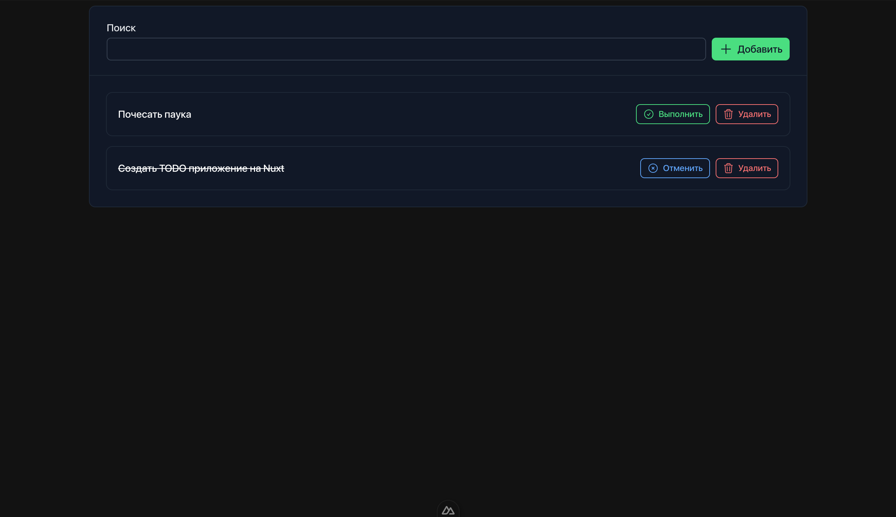

# Nuxt TODO

> Шаблон приложения на Nuxt + TRPC + Nuxt UI (tailwind)

## Как выглядит



## Как развернуть

### Сборка

1. Выполнить

```bash
npm install
```

2. Выполнить

```bash
npm run build
```

### Запуск

```bash
npm start
```

Опциональные переменные окружения:

- `PORT` порт на котором будет работать (по умолчанию - 3000)
- `INSTANCES_COUNT` кол-во потоков, которые будет использовать приложение (по умолчанию - кол-во ядер процессора)
